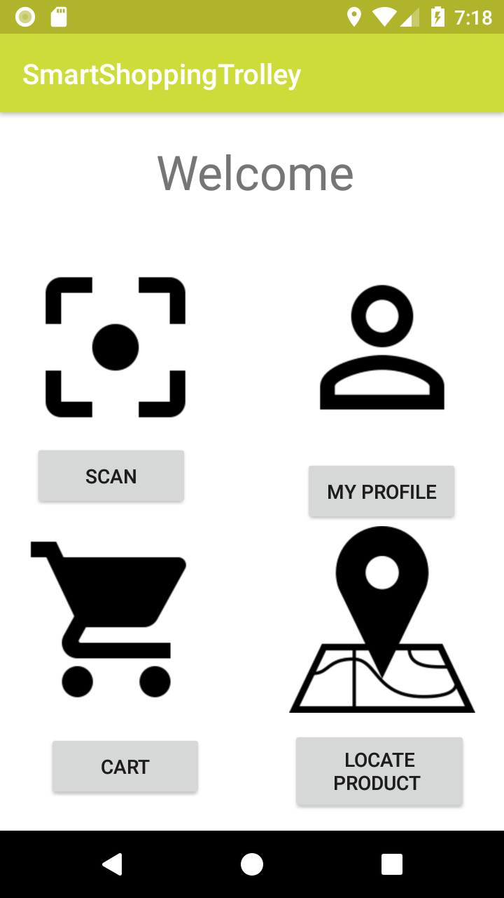

# Smart Shopping Trolley

 
      

# About the project:

Android application that can be used to facilitate the shopping process.
This application will be able to scan QR code on proudcts, This app can be used in shopping malls, supermarkets, retails stores and so on, it will improves customer experience while shopping.  

# Features Included:
- Customer will be easily go through full information about product by scanning the QR code
- Customer can be able to locate a product
- Add the products in Cart
- calculate the total price
- pay online 

# GP is done by students:

- Lama Albarrak
- Haneen Alabdullah
- Shaden Almudahish
- Alanoud Alqhtani
- Hatham Alsadaan
- Asma Alquraishi
